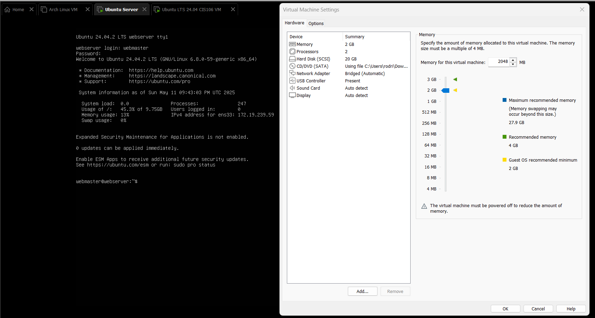
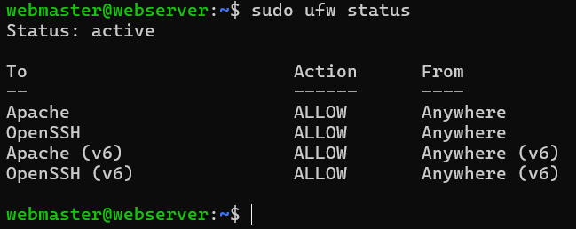
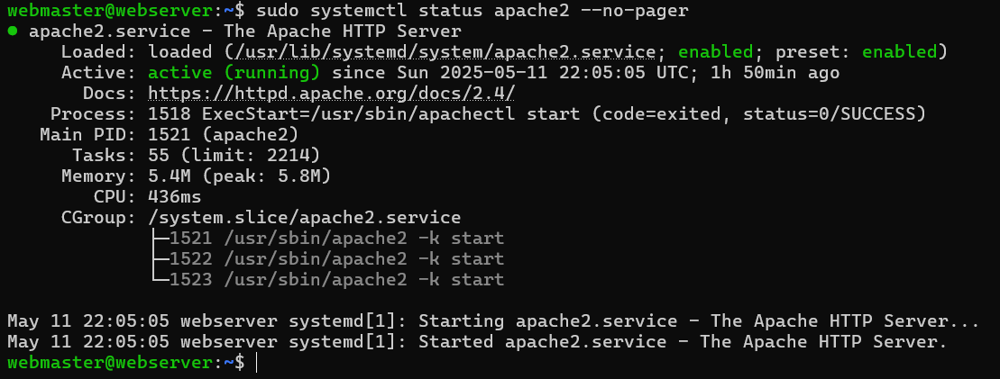
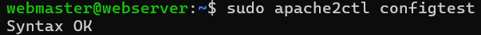
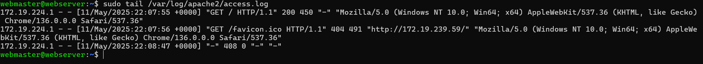
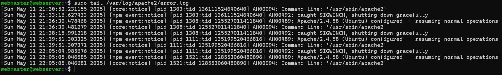

# Deliverable 2 Submission

## Ubuntu Login Screen & Server Specifications

## Questions

2. **What is the IP address of your Ubuntu Server Virtual Machine?**  
`172.19.239.59`

3. **How do you enable the Ubuntu Firewall?**  
`sudo ufw enable`

4. **How do you check if the Ubuntu Firewall is running?**  
`sudo ufw status`

5. **How do you disable the Ubuntu Firewall?**  
`sudo ufw disable`

6. **How do you add Apache to the Firewall?**  
`sudo ufw allow 'Apache'`

7. **What is the command you used to install Apache?**  
`sudo apt install apache2`

8. **What is the command you use to check if Apache is running?**  
`systemctl status apache2 --no-pager`

9. **What is the command you use to stop Apache?**  
`sudo systemctl stop apache2`

10. **What is the command you use to restart Apache?**  
`sudo systemctl restart apache2`

11. **What is the command used to test Apache configuration?**  
`sudo apache2ctl configtest`

12. **What is the command used to check the installed version of Apache?**  
`apache2 -v`

13. **What are the most common commands to troubleshoot Apache errors? Provide a brief description of each command.**  
- `systemctl status apache2`: Check the status of Apache and any active issues.  
- `journalctl -xe`: View detailed system logs for debugging startup issues.  
- `apache2ctl configtest`: Test the syntax of Apache configuration files.  
- `tail -f /var/log/apache2/error.log`: Watch the Apache error log in real-time for new entries.

14. **Which are Apache Log Files, and what are they used for? Provide examples and screenshots.**  
Apache logs are stored in `/var/log/apache2/`. The two most important ones are:  
- `access.log`: Records incoming HTTP requests and responses.  
  Example:  
  `sudo tail /var/log/apache2/access.log`
  
- `error.log`: Contains errors, warnings, and diagnostic information.  
  Example:  
  `sudo tail /var/log/apache2/error.log`
  