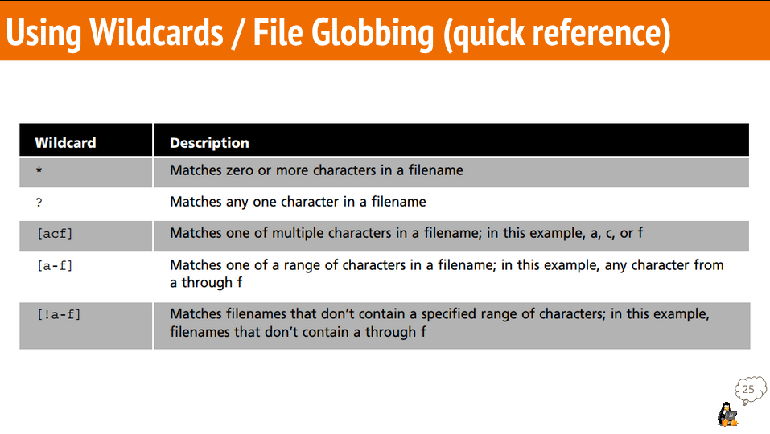

# Notes 6

**Wildcards, or file globbing, is a shell feature that uses special characters to allow us to rapidly specify groups of filenames. Because we work with files all the time, it is useful to be able to work with multiple files at the same time.**

| Wildcard |              Definition               |           Example            |
| :------: | :-----------------------------------: | :--------------------------: |
|    *     | Matches 0 to any number of characters |    `ls ~/Downloads/*.png`    |
|    ?     |         Matches 1 character.          |   `ls ~/Downloads/f?ll.sh`   |
|    []    |    Matches 1 character from a set     | `ls ~/Downloads/f[0-9]ll.sh` |
-----------------------------------------------------------------------------------

## `*` (Star/Asterisk) Wildcard

* Matches 0 to any number of characters.

### Examples:
  
* List all the .txt files:
  * `ls *.txt`
* List all of the directories inside a given directory without listing their content:
  * `ls -1d wildcard_extra_practice/*/`
* Move all of the .sh (shell scripts) files:
  *  `mv wildcard_extra_practice/*.sh wildcard_extra_practice/scripts/`
*  List and then move all the image files in the wildcard_extra_practice directory. You will need to create a directory first.
   *  `mkdir wildcard_extra_practice/images/`
   *  `ls wildcard_extra_practice/img-*.*`
   *  `mv -v wildcard_extra_practice/img-*.*images/`

## `?` (Question mark) Wildcard

* The`?` wildcard metacharacter matches **precisely one character.** It proves very useful when working with hidden files (hidden files are also called **dot files**).

### Examples:
* List all the files that contain a 4 letter file extension:
  * `s -1X wildcard_extra_practice/*.????`
* List all the files that contain a 4 letter file extension and start with the letter i:
  *  `ls -1X wildcard_extra_practice/i*.????`
*  List all the Microsoft Office 365 files:
   *  `ls -1X wildcard_extra_practice/*.???x`

## `[]` (Square brackets) Wildcard
* The `[]` wildcard is used to match a single character from a specified set of characters. It allows you to define a character range or a specific set of characters that should be matched at a particular position in a filename or other pattern

### Examples:
* List all the files that start with a capital letter:
  * `ls wildcard_extra_practice/[A-Z]*`
* List all the files that contain a number in their name:
  * `ls wildcard_extra_practice/[0-9]`
* Match all files with the .txt extension where the single character in the brackets is any lowercase letter:
  * `ls file[a-z].txt`

## `{}` Brace Expansion
* Brace expansion `{}` is not a wildcard but another feature of bash that allows you to generate arbitrary strings to use with commands.

### Examples:
* To create a while directory structure in a single command:
  * `mkdir -p music/{jazz,rock}/{mp3files,videos,oggfiles}/new{1..3}`
* To create a N number of files use:
  * `touch website{1..5}.html`
  * `touch file{A..Z}.txt`
  * `touch file{001..10}.py`
  * `touch file{{a..z},{0..10}}.js`
* Remove multiple files in a single directory:
  * `rm -r {dir1,dir2,dir3,file.txt,file.py}`