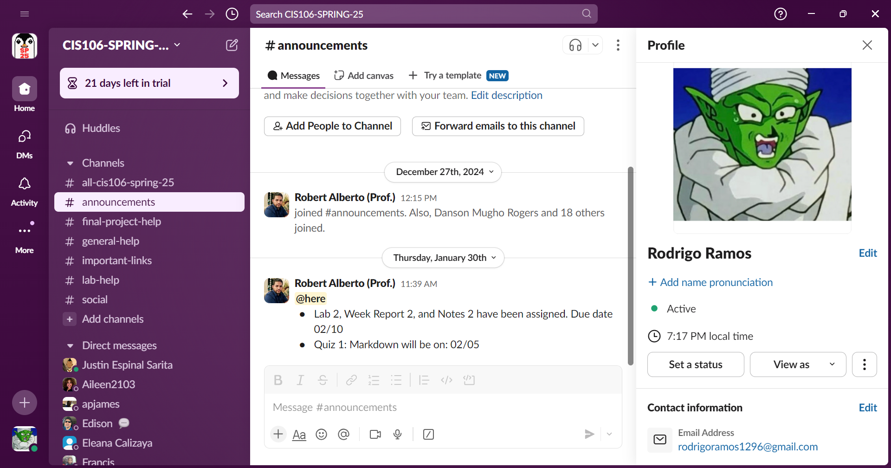
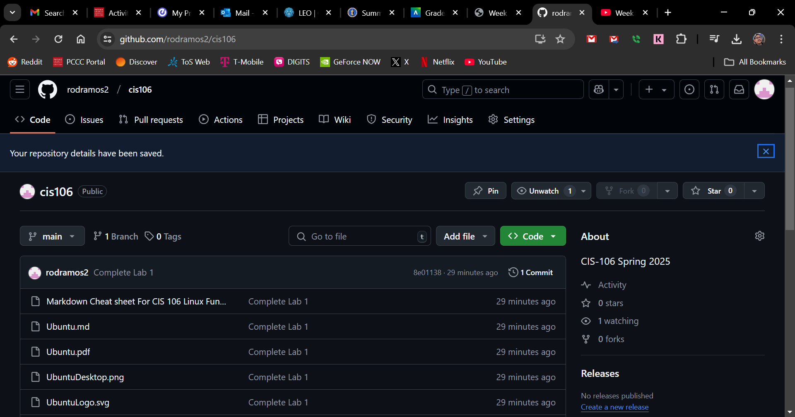

# Week Report 1 Submission

## Slack Screenshot

## Github Screenshot

## Acknowledgements
* By submitting this assignment I, Rodrigo Ramos, acknowledge that I have read the syllabus and final project description.
* I also acknowledge that I have written down any questions that I have for the professor and will ask them in class or via slack 1:1.
