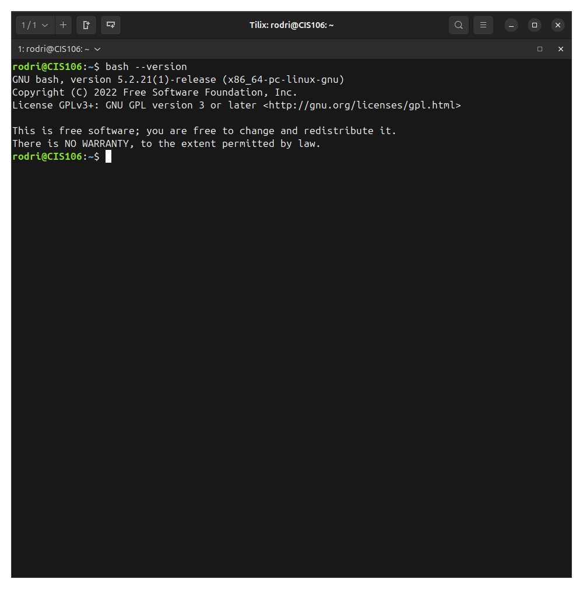
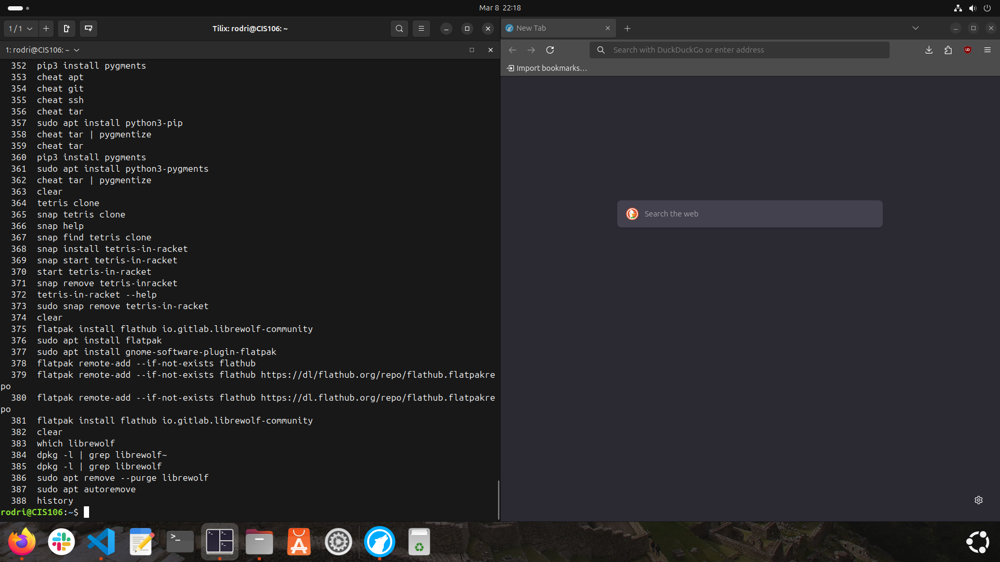

# Week Report 3
## Completed work for week 3
* [Lab 3](../../labs/lab3/lab3.md)
* [Notes 3](../../notes/notes3/notes3.md)

### Practice 2: Accessing the Bash Shell

### Practice 3: Using the command history

### Practice 4: My first Shell Script

### Practice 5: Using man

### Practice 6: Using the help option

### Practice 7: Cheat!

### Practice 1: Managing Software

### Practice 3: Installing and removing Snap
 
### Practice 4: Working with FlatPak
